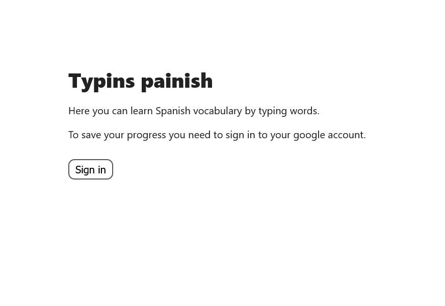
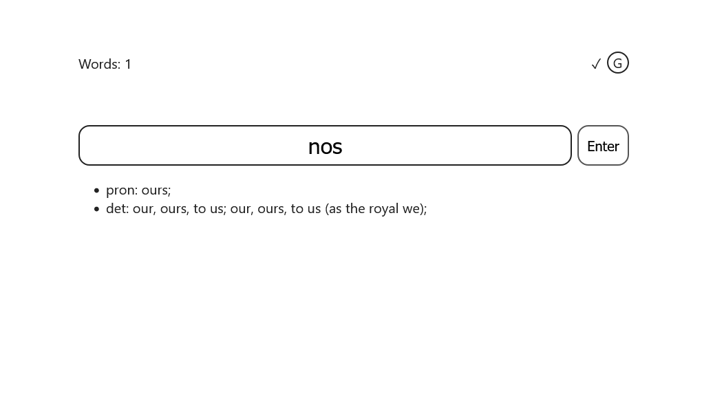
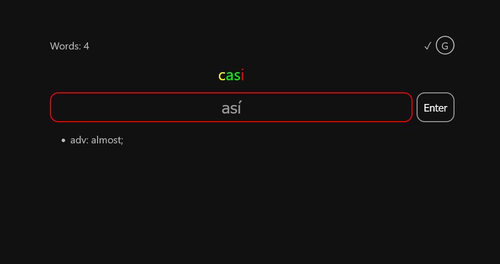
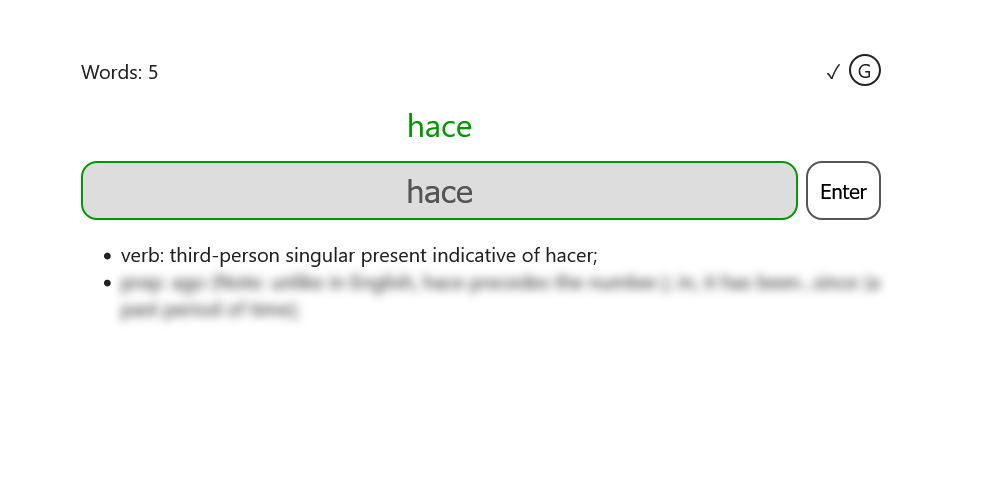

# Typins painish

    
    
    
    

Learn Spanish by typing

Main features:
- Helps remembering Spanish words' meaning and spelling
- Optimally arranges revise/learning new words times
- Suggest the most frequent words to learn first
- Saves progress to Google Drive = no progress would ever be lost
- Light and dark theme
- Shows spelling mistakes nicely
- Statistics for motivation
- Fontend-only = everybody can host themself for free

Stack: Typescript, React, Google Drive API, Gihub Actions

## Getting Started

-   `npm i` - Installs dependencies

-   Create Google application to get API key and Client ID, add them to `.env` (you can copy `.env.example` and change the copy), add them to github secrets for Github Actions deploy

-   `npm run dev` - Starts a dev server at http://localhost:5173/

-   `npm run build` - Builds for production, emitting to `dist/`

-   `npm run preview` - Starts a server at http://localhost:4173/ to test production build locally
